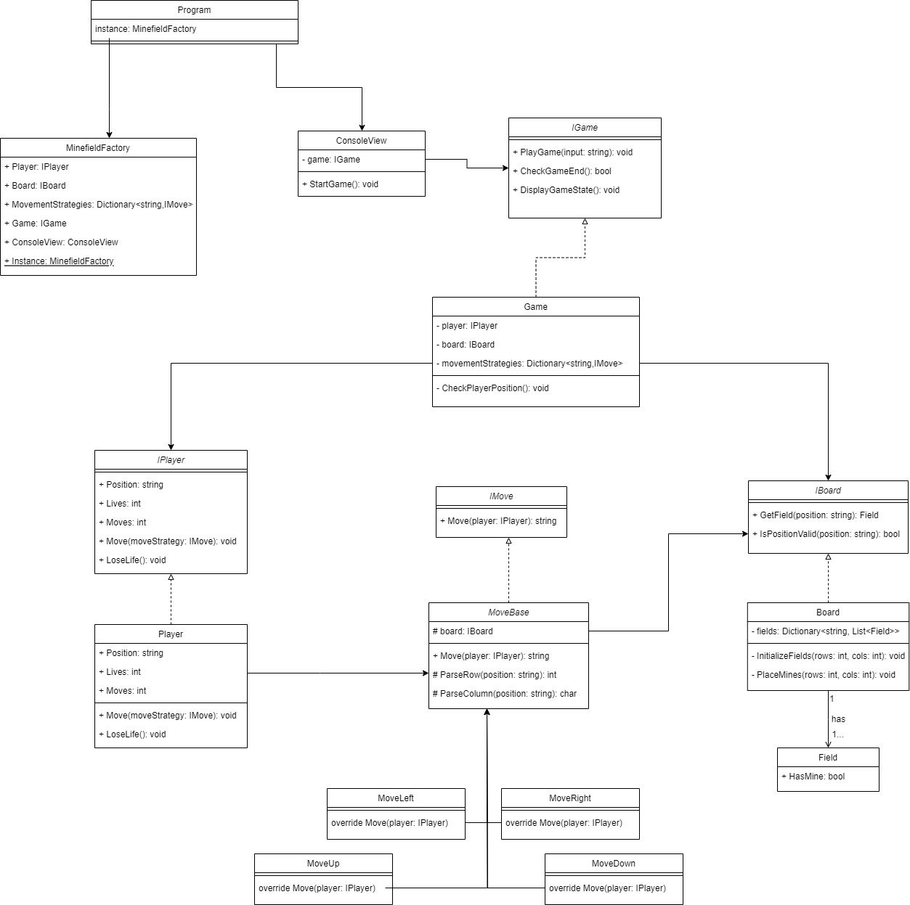

# Developer Coding Test – Minefield Game
## The Test
Create a console application that runs a minefield/minesweeper style game, in which the player navigates from one side of a chessboard grid to the other whilst trying to avoid hidden mines. The player has a number of lives, losing one each time a mine is hit, and the final score is the number of moves taken in order to reach the other side of the board. The console interface should be simple, allowing the player to input move direction (up, down, left, right) and the game to show the resulting position (e.g. C2 in chess board terminology) along with number of lives left and number of moves taken.
* You should take effort to demonstrate clean coding and use of recognized design principles in your solution
* Implement appropriate automated unit testing

## Software Design



## Project Setup and Configuration

Begin by making sure the prerequisites are installed on your computer.

Prerequisites:
* Dotnet 8
* MsTest
* VSCode for development

### Application startup

In order to startup application from VSCode or terminal, position yourself to `MinefieldGame` project and execute commands:
```bash
dotnet build
dotnet run
```

### Unit tests

In order to run unit tests from VSCode or terminal, position yourself to `MinefieldGameTest` project and execute command:
```bash
dotnet test MinefieldGameTest.csproj
```